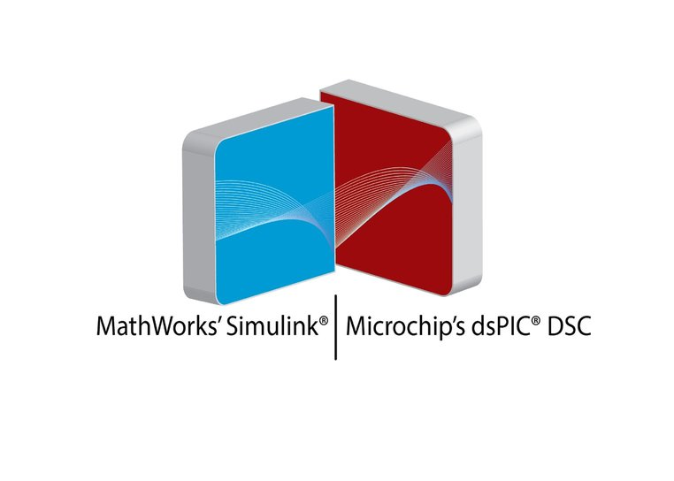

# MPLAB Device Blocks for Simulink

**Microchip official blockset v3.45** supporting up to 348 microcontrollers.

MPLAB Device Blocks for Simulink enables Embedded Coder for automated build and execution of real-time executable for any board equipped with a dsPIC :registered:, PIC32 :registered: or SAMx7 from a Simulink model.

This support package is functional for R2010a and beyond.

## Installation

1. [download](https://github.com/LubinKerhuel/MPLAB-Device-Blocks-for-Simulink/archive/master.zip) and unzip the package
2. execute the .p installer script . Within Matlab, right click on file install.p and select run.

The MCHP\_example folder is created in the current folder and examples copied into.

Visit the Microchip [blockset forum](https://www.microchip.com/forums/f192.aspx)

## Presentation

Peripheral blocks configure and inserts code in the MathWorks generated code by embedded coder. (non-exhaustive peripheral block list: ADC, QEI, PWM, IC, OC, CN, I2C, SPI, UART, Op-Amp, Comparator, DAC...)

No embedded programming knowledge is required. The toolbox transforms any board equipped with a supported MCU into a rapid control prototyping tool and enable a model-based design development scheme.

## Features

- Built-in scheduler including single-tasking and multi-tasking option for multi-rate models.
- Advanced configuration of ADC / PWM peripheral enable PMSM motor algorithm where ADC sample time is triggered precisely within a PWM duty-cycle. The time step might also be triggered by end of ADC conversion minimizing delays.
- A custom protocol allows visualizing and recording data through the UART. The custom picgui interface allows plotting using your own matlab script incoming data in real-time. Data log enable further analysis or offline identification and allow to feed a simulation with real data.
- The custom "C function" block allows including your own code if required.

The blockset also support MathWorks features:

- Hardware in the loop (HIL)
- External mode.
- Code replacement to benefit from DSP architecture of dsPIC

This version embed a third part tool adding blocks for UAVs projects (GPS, MAVLink, Receiver S.BUS, S.Port and F.Port blocks for dsPIC). Type picInfo to find out how to install the UxV blocks.

## Requirements

- MathWorks (from R2010a to R2019a)   
  - Simulink
  - Embedded Coder
  - Matlab Coder
  - Simulink Coder  
- Microchip
  - MPLAB X IDE [download](https://www.microchip.com/MPLABX)
  - xc16 compiler for 16 bits devices [download](https://www.microchip.com/xc16) (dsPIC)
  - xc32 compiler for 32 bits devices [download](https://www.microchip.com/xc32) (PIC32, SAMx7)

## Release notes
- v3.45.04:
  - Fixed possible issue with MPLAB X project creation with model targeting PIC32
  - Fixed Typo on Timer code generator for PIC32 (project not compiling when problem occurs)
  - Added an External Mode example for PIC32MZ + minor update on other example and script compiling all models
- v3.45.03:
  - Fixed wrong heap linker flag at command line for PIC32 when using Compiler Option block  
  - Fixed PIL and External Mode GUI not showing the model UART block settings.
- v3.45.02: 
  - Added IPE or MDB choice for programming (previously automatically selected)
  - Added support for comparator for dsPIC33FJxxMC 02/06
  - Added support for SNAP and PICKIT 4 programmer with MDB interface
  - Removed files generated by programmer interface (MDB or IPE) in working folder.
  - Fixed some issue with SAMx70 and SAMx71 family
  - Reduced Wait State for SAMV
  - Updated motor example for SAME70 PIM with MCLV2 board
  - Added missing dsPIC33CK
  - Improved compatibility with Matlab R2010a
  - Extended block GUI text fields which can evaluate workspace variables
  - UxV toolbox: improved compatibility with R2010a

### Supported MCU

1. 30F2010
2. 30F2011
3. 30F2012
4. 30F3010
5. 30F3011
6. 30F3012
7. 30F3013
8. 30F3014
9. 30F4011
10. 30F4012
11. 30F4013
12. 30F5011
13. 30F5013
14. 30F5015
15. 30F5016
16. 30F6010
17. 30F6011
18. 30F6012
19. 30F6013
20. 30F6014
21. 30F6015
22. 33CK128MP202
23. 33CK128MP203
24. 33CK128MP205
25. 33CK128MP206
26. 33CK128MP208
27. 33CK128MP502
28. 33CK128MP503
29. 33CK128MP505
30. 33CK128MP506
31. 33CK128MP508
32. 33CK256MP202
33. 33CK256MP203
34. 33CK256MP205
35. 33CK256MP206
36. 33CK256MP208
37. 33CK256MP502
38. 33CK256MP503
39. 33CK256MP505
40. 33CK256MP506
41. 33CK256MP508
42. 33CK32MP102
43. 33CK32MP103
44. 33CK32MP105
45. 33CK32MP202
46. 33CK32MP203
47. 33CK32MP205
48. 33CK32MP206
49. 33CK32MP502
50. 33CK32MP503
51. 33CK32MP505
52. 33CK32MP506
53. 33CK64MP102
54. 33CK64MP103
55. 33CK64MP105
56. 33CK64MP202
57. 33CK64MP203
58. 33CK64MP205
59. 33CK64MP206
60. 33CK64MP208
61. 33CK64MP502
62. 33CK64MP503
63. 33CK64MP505
64. 33CK64MP506
65. 33CK64MP508
66. 33EP128GM304
67. 33EP128GM306
68. 33EP128GM310
69. 33EP128GM604
70. 33EP128GM706
71. 33EP128GM710
72. 33EP128GP502
73. 33EP128GP504
74. 33EP128GP506
75. 33EP128GS702
76. 33EP128GS704
77. 33EP128GS705
78. 33EP128GS706
79. 33EP128GS708
80. 33EP128GS804
81. 33EP128GS805
82. 33EP128GS806
83. 33EP128GS808
84. 33EP128MC202
85. 33EP128MC204
86. 33EP128MC206
87. 33EP128MC502
88. 33EP128MC504
89. 33EP128MC506
90. 33EP16GS202
91. 33EP16GS502
92. 33EP16GS504
93. 33EP16GS505
94. 33EP16GS506
95. 33EP256GM304
96. 33EP256GM306
97. 33EP256GM310
98. 33EP256GM604
99. 33EP256GM706
100. 33EP256GM710
101. 33EP256GP502
102. 33EP256GP504
103. 33EP256GP506
104. 33EP256MC202
105. 33EP256MC204
106. 33EP256MC206
107. 33EP256MC502
108. 33EP256MC504
109. 33EP256MC506
110. 33EP256MU806
111. 33EP256MU810
112. 33EP256MU814
113. 33EP32GP502
114. 33EP32GP503
115. 33EP32GP504
116. 33EP32GS202
117. 33EP32GS502
118. 33EP32GS504
119. 33EP32GS505
120. 33EP32GS506
121. 33EP32MC202
122. 33EP32MC203
123. 33EP32MC204
124. 33EP32MC502
125. 33EP32MC503
126. 33EP32MC504
127. 33EP512GM304
128. 33EP512GM306
129. 33EP512GM310
130. 33EP512GM604
131. 33EP512GM706
132. 33EP512GM710
133. 33EP512GP502
134. 33EP512GP504
135. 33EP512GP506
136. 33EP512GP806
137. 33EP512MC202
138. 33EP512MC204
139. 33EP512MC206
140. 33EP512MC502
141. 33EP512MC504
142. 33EP512MC506
143. 33EP512MC806
144. 33EP512MU810
145. 33EP512MU814
146. 33EP64GP502
147. 33EP64GP503
148. 33EP64GP504
149. 33EP64GP506
150. 33EP64GS502
151. 33EP64GS504
152. 33EP64GS505
153. 33EP64GS506
154. 33EP64GS708
155. 33EP64GS804
156. 33EP64GS805
157. 33EP64GS806
158. 33EP64GS808
159. 33EP64MC202
160. 33EP64MC203
161. 33EP64MC204
162. 33EP64MC206
1. 33EP64MC502
2. 33EP64MC503
3. 33EP64MC504
4. 33EP64MC506
5. 33EV128GM002
6. 33EV128GM003
7. 33EV128GM004
8. 33EV128GM006
9. 33EV128GM102
10. 33EV128GM103
11. 33EV128GM104
12. 33EV128GM106
13. 33EV256GM002
14. 33EV256GM003
15. 33EV256GM004
16. 33EV256GM006
17. 33EV256GM102
18. 33EV256GM103
19. 33EV256GM104
20. 33EV256GM106
21. 33EV32GM002
22. 33EV32GM003
23. 33EV32GM004
24. 33EV32GM006
25. 33EV32GM102
26. 33EV32GM103
27. 33EV32GM104
28. 33EV32GM106
29. 33EV64GM002
30. 33EV64GM003
31. 33EV64GM004
32. 33EV64GM006
33. 33EV64GM102
34. 33EV64GM103
35. 33EV64GM104
36. 33EV64GM106
37. 33FJ128GP202
38. 33FJ128GP204
39. 33FJ128GP206
40. 33FJ128GP206A
41. 33FJ128GP306
42. 33FJ128GP306A
43. 33FJ128GP310
44. 33FJ128GP310A
45. 33FJ128GP706
46. 33FJ128GP706A
47. 33FJ128GP708
48. 33FJ128GP708A
49. 33FJ128GP710
50. 33FJ128GP710A
51. 33FJ128GP802
52. 33FJ128GP804
53. 33FJ128MC202
54. 33FJ128MC204
55. 33FJ128MC506
56. 33FJ128MC506A
57. 33FJ128MC510
58. 33FJ128MC510A
59. 33FJ128MC706
60. 33FJ128MC706A
61. 33FJ128MC708
62. 33FJ128MC708A
63. 33FJ128MC710
64. 33FJ128MC710A
65. 33FJ128MC802
66. 33FJ128MC804
67. 33FJ12GP201
68. 33FJ12GP202
69. 33FJ12MC201
70. 33FJ12MC202
71. 33FJ16GP304
72. 33FJ16MC304
73. 33FJ256GP506
74. 33FJ256GP506A
75. 33FJ256GP510
76. 33FJ256GP510A
77. 33FJ256GP710
78. 33FJ256GP710A
79. 33FJ256MC510
80. 33FJ256MC510A
81. 33FJ256MC710
82. 33FJ256MC710A
83. 33FJ32GP202
84. 33FJ32GP204
85. 33FJ32GP302
86. 33FJ32GP304
87. 33FJ32MC202
88. 33FJ32MC204
89. 33FJ32MC302
90. 33FJ32MC304
91. 33FJ64GP202
92. 33FJ64GP204
93. 33FJ64GP206
94. 33FJ64GP206A
95. 33FJ64GP306
96. 33FJ64GP306A
97. 33FJ64GP310
98. 33FJ64GP310A
99. 33FJ64GP706
100. 33FJ64GP706A
101. 33FJ64GP708
102. 33FJ64GP708A
103. 33FJ64GP710
104. 33FJ64GP710A
105. 33FJ64GP802
106. 33FJ64GP804
107. 33FJ64MC202
108. 33FJ64MC204
109. 33FJ64MC506
110. 33FJ64MC506A
111. 33FJ64MC508
112. 33FJ64MC508A
113. 33FJ64MC510
114. 33FJ64MC510A
115. 33FJ64MC706
116. 33FJ64MC706A
117. 33FJ64MC710
118. 33FJ64MC710A
119. 33FJ64MC802
120. 33FJ64MC804
121. 32MK0512MCF064
122. 32MK0512MCF100
123. 32MK0512MCM064
124. 32MK0512MCM100
125. 32MK1024MCF064
126. 32MK1024MCF100
127. 32MK1024MCM064
128. 32MK1024MCM100
129. 32MZ1024EFG064
130. 32MZ1024EFG100
131. 32MZ1024EFG124
132. 32MZ1024EFG144
133. 32MZ1024EFH064
134. 32MZ1024EFH100
135. 32MZ1024EFH124
136. 32MZ1024EFH144
137. 32MZ1024EFM064
138. 32MZ1024EFM100
139. 32MZ1024EFM124
140. 32MZ1024EFM144
141. 32MZ2048EFG064
142. 32MZ2048EFG100
143. 32MZ2048EFG124
144. 32MZ2048EFG144
145. 32MZ2048EFH064
146. 32MZ2048EFH100
147. 32MZ2048EFH124
148. 32MZ2048EFH144
149. 32MZ2048EFM064
150. 32MZ2048EFM100
151. 32MZ2048EFM124
152. 32MZ2048EFM144
153. SAME70J19B
154. SAME70J20B
155. SAME70J21B
157. SAME70N19B
158. SAME70N20B
161. SAME70N21B
162. SAME70Q19B
164. SAME70Q19B
167. SAME70Q20B
170. SAME70Q21B
172. SAMS70J19B
174. SAMS70J20B
176. SAMS70J21B
179. SAMS70N19B
180. SAMS70N20B
185. SAMS70N21B
188. SAMS70Q19B
191. SAMS70Q20B
194. SAMS70Q21B
195. SAMV70J19B
196. SAMV70J20B
197. SAMV70N19B
199. SAMV70N20B
201. SAMV70Q19B
204. SAMV70Q20B
205. SAMV71J19B
206. SAMV71J20B
207. SAMV71J21B
209. SAMV71N19B
211. SAMV71N20B
212. SAMV71N21B
214. SAMV71Q19B
216. SAMV71Q20B
218. SAMV71Q21B

